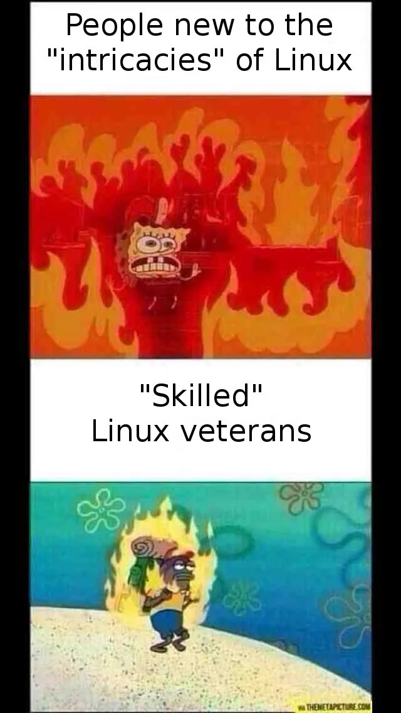

# pingupurkka
Using linux in school sure is fun.

## What?
This repository is a collection of workarounds and patchwork to do school coursework on [Fedora 37](https://getfedora.org/). In classic linux user fashion, there's no official support - RTFM and novel workarounds are just a tad implied. Since I use Fedora on laptop and Windows on home PC, I try to use tools aimed for standardizing developer environments across different operating systems, namely [containers](https://docs.fedoraproject.org/en-US/fedora-server/containerization/) on linux and [Vagrant](https://www.vagrantup.com/) on Windows.

## Directory structure
Each subdirectory corresponds to a course, and contains the specific files needed to set up and run the cource work on both linux and Windows. They will each have their own README to document the specifics of the problem, my solution, and how to use the said solution.

## Basics
Documenting my reasoning for the fundamental tooling I'm using for both linux and Windows.

### Fedora 37
On Fedora I'll use containers when possible. I've found [Docker](https://docs.docker.com/) with compose to be very handy to run one-off stacks of software in a "self-documenting" fashion. I know what I've installed, how they relate to each other, their specific configs. They also probably work regardless on what system I run them.
 
### Windows 10 LTSC 2019
Now, I could use the Windows workflow designated by the courses, but I want to get used to running a familiar environment for all development I do. For this reason I'm using [Vagrant](https://www.vagrantup.com/) with [ansible](https://www.ansible.com/overview/how-ansible-works) provisioning to run a virtualized linux environment. From my experience Vagrant+ansible is the most hands-off write-it-once itjustwerks method to setup and use a tailored linux+devtools environment on Windows 10 LTSC 2019, which I'm using. I'm probably not going to explain how to use it in this repo, since the initial setup is pretty involved. We'll see.

## Inspirational imagery
